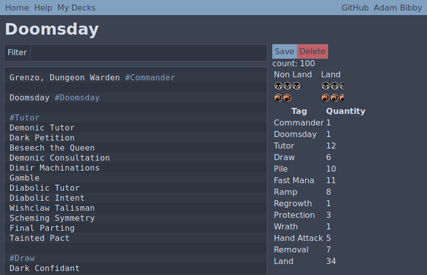
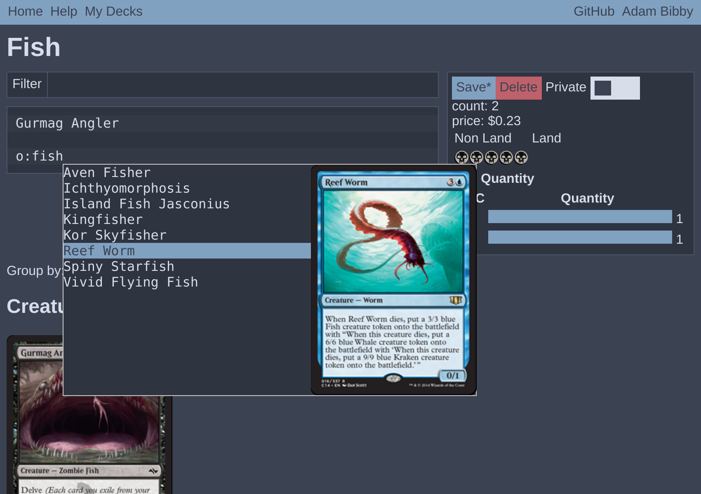

# Turbo Slug

Turbo Slug is a free and open source deck builder for Magic: The Gathering.

## Autocomplete

Turbo Slug has super fast autocomplete when entering cards. It allows you to
search for card names, oracle text and more!

### Syntax
Each row in the deck editor represents one card in your deck. The row can start
with a number and an optional x for the quantity of that card, or nothing if
there is only one, then the name of the card, and finally a list of tags each
starting with a hash. e.g. `1 Ponder #cantrip` or `3x Stomping Ground` or
`Force of Will`

### Searching

When typing in the deck editor you can use a simple search syntax based on
Scryfall's to find cards. Just typing on the box will search by card name and
you can apply more complex filters by entering a keyword followed by a colon and
what you want to search. For example you could search for legendary cards with
`type:legend`. If you want to search by more than 1 word you can use quotes to
wrap them, e.g. `o:"draw a card"`.

| keyword | shortcut | filter                       |
| ------- | -------- | ---------------------------- |
| oracle  | o        | oracle text                  |
| type    | t        | whole type line              |
| set     | s        | set                          |
| color   | c        | color identity               |
| legal   | l        | formats the card is legal in |
